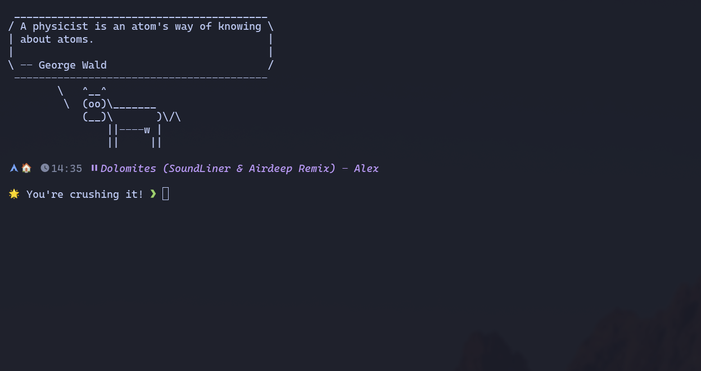

# Starship Prompt Configuration

A feature-rich Starship prompt with live music tracking, motivational quotes, and comprehensive git information.

## Screenshot



## Features

### 🎨 Visual Design
- **Catppuccin Mocha** color scheme
- Clean, minimalist layout
- Custom icons for all programming languages
- Home directory icon (🏠) substitution

### 🎵 Live Features
- **Music Tracking**: Shows currently playing track from playerctl
- **Random Quotes**: Motivational messages that change each prompt
- **Git Integration**: Branch, status, commits with visual indicators
- **Command Duration**: Shows execution time for long-running commands

### 📦 Language Detection
Automatic detection and icons for:
- Node.js (⬢)
- Python (🐍)
- Rust (🦀)
- Go (🐹)
- Ruby (💎)
- Java (☕)
- Next.js (▲)
- And many more...

### 📊 System Info
- OS icon
- Shell level indicator
- Memory usage (when >75%)
- Background jobs counter
- Command exit status

## Installation

1. Install [Starship](https://starship.rs/)
2. Copy `starship.toml` to `~/.config/starship.toml`
3. Add to your shell rc file:
   ```bash
   eval "$(starship init bash)"
   ```

## Dependencies

- **Nerd Font**: JetBrainsMono Nerd Font recommended
- **playerctl**: For music tracking
- **git**: For repository information

## Customization

### Music Module
The music module uses playerctl to detect playing media:
- 󰎆 icon when playing
- 󰏤 icon when paused

### Quotes
Random motivational quotes appear on each prompt:
- "🚀 Deploying happiness, one commit at a time"
- "☕ Powered by caffeine and syntax errors"
- "🎯 Bugs are just features in disguise"
- And more...

## Configuration Highlights

```toml
# Custom Next.js detection
[custom.nextjs]
command = "if [ -f next.config.js ]; then echo '▲'; fi"

# Live music tracking
[custom.music]
command = "playerctl metadata --format '󰎆 {{ title }} - {{ artist }}'"
```

## Font Configuration

For proper icon display, ensure your terminal uses a Nerd Font. The config is optimized for JetBrainsMono Nerd Font at 16px.